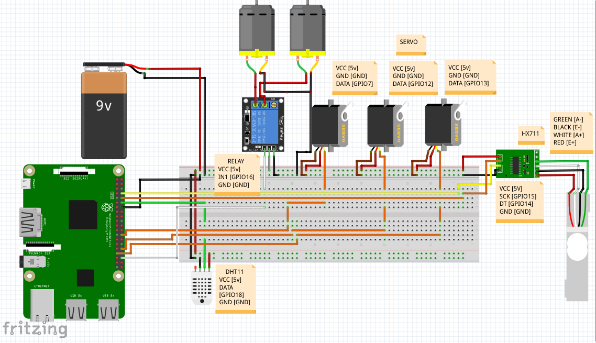

# SIC4 - Stempels [Smart Tempe Laboratories]


## Daftar Isi
- [Penjelasan Alat dan Fitur-Fitur Stempels](#penjelasan-alat-dan-fitur-fitur-stempels)
  - [Daftar Isi](#daftar-isi)
  - [Hardware yang Digunakan](#hardware-yang-digunakan)
  - [Rangkaian](#Rangkaian-Alat)
  - [Software yang Digunakan](#software-yang-digunakan)
  - [Fitur Conveyor Belt dengan Pemotongan](#fitur-conveyor-belt-dengan-pemotongan)
  - [Pengangkatan Keripik (dari Bumbu dan dari Penggorengan)](#pengangkatan-keripik-dari-bumbu-dan-dari-penggorengan)
  - [Penggorengan dengan Pengstabil Suhu Minyak dan Timer](#penggorengan-dengan-pengstabil-suhu-minyak-dan-timer)
  - [Penimbangan Keripik](#penimbangan-keripik)
  - [Cara Penggunaan](#cara-Penggunaan)

## Hardware yang Digunakan
- Raspberry Pi sebagai komputer utama
- Sensor berat HX711
- Sensor suhu dan kelembaban DHT11
- Servo
- Conveyor belt
- Pisau presisi

## Rangkaian Alat





## Software yang Digunakan
- Ubidots untuk platform pengumpulan dan tampilan data
- Aplikasi "Stempels" untuk memantau data dan pengaturan dari software Kodular

## Fitur Conveyor Belt dengan Pemotongan
Salah satu fitur utamanya adalah penggunaan conveyor belt dengan sistem pemotongan presisi menggunakan servo dan pisau, memastikan potongan tempe yang seragam.

## Pengangkatan Keripik (dari Bumbu dan dari Penggorengan)
Setelah dipotong, keripik tempe masuk ke kolam bumbu melalui conveyor belt dan diangkat oleh servo, kemudian dimasukkan ke penggorengan.

## Penggorengan dengan Pengstabil Suhu Minyak dan Timer
Penggorengan dilengkapi dengan pengstabil suhu minyak dan timer untuk memastikan keripik tempe digoreng pada suhu dan waktu yang optimal.

## Penimbangan Keripik
Setelah penggorengan selesai, keripik tempe diangkat ke tempat penimbangan menggunakan pengangkat, dan hasil timbangan ditampilkan melalui platform Ubidots dan aplikasi "Stempels".Dengan fitur-fitur unggulannya, Stempels memberikan efisiensi, konsistensi, dan kemudahan dalam proses pembuatan keripik tempe.

## Cara Penggunaan
```bash
git clone https://github.com/Alta02/SIC4-Stempels.git
cd SIC4-Stempels/SIC4/Final
python3 main.py
```
